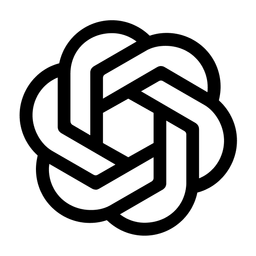
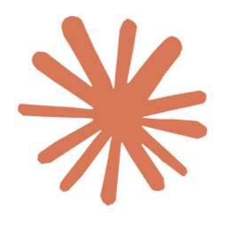
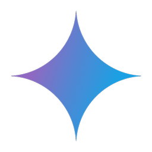
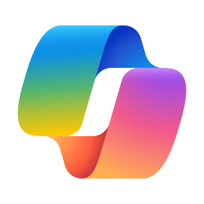
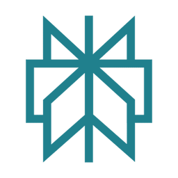
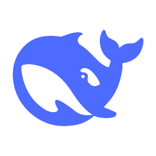
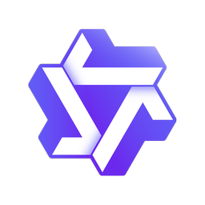

# Chatbot Matrix

The almighty chatbot comparison grid.

| Feature | ChatGPT <a href="https://chatgpt.com"><picture><source media="(prefers-color-scheme: dark)" srcset="img/icon_chatgpt_light.png"><source media="(prefers-color-scheme: light)" srcset="img/icon_chatgpt.png"></picture></a> | Claude  | Gemini  | Mistral  | Copilot  | Perplexity <a href="https://www.perplexity.ai"><picture><source media="(prefers-color-scheme: dark)" srcset="img/icon_perplexity_light.png"><source media="(prefers-color-scheme: light)" srcset="img/icon_perplexity.png"></picture></a> | DeepSeek  | Qwen  |
|:-|:-|:-|:-|:-|:-|:-|:-|:-|
| Company | OpenAI | Anthropic | Google | Mistral | Microsoft | Perplexity | DeepSeek | Alibaba |
| Most recent model | ChatGPT o3 | Claude 3.5 Sonnet | Gemini 2.0 Flash | Mistral Large | "Copilot" | "Perplexity" | V3 / R1 | 2.5 Max |
| Access to latest models | Paid 💰20 or 200$/m | Paid 💰18$/m | Paid 💰22$/m | Free ✅ | Free ✅ | Paid 💰20$/m | Free ✅ | Free ✅ |
| Context window (tokens) 📏 | 128 K | 200 K | 1000 K | 32 K / 128 K | ? | ? | 64 K | 32 K/ 128 K |
| Reasoning 🧠 | Yes ✅ | No ❌ | Yes ✅ | No ❌ | Yes ✅ | No ❌ | Yes ✅ | No ❌ |
| Web search with source citation 🔍 | Yes ✅ "Search" | No ❌ | Yes ✅ "DeepSearch" | Yes ✅ | Yes ✅ | Yes ✅ | Yes ✅ | Yes ✅ |
| Image generation 🎨 | Yes ✅ (DALL-E3) | No ❌ | Yes ✅ (Imagen-3) | Yes ✅ (Flux Pro) | Yes ✅ ("DALL-E 3") | No ❌ | No ❌ | Yes ✅ |
| Analysis of images / documents 🖼️ | Yes ✅ | Yes ✅ | Yes ✅ | Yes ✅ | Yes ✅ | Paid 💰 | No/ Yes ✅ | Yes ✅ |
| Live mode 🎤 | Multimodal ✅ | No ❌ | Voice only ✅ | No ❌ | Voice only ✅ | No ❌ | No ❌ | No ❌ |
| Online "canvas" edition 🖊️ | Paid ✅ | Limited ✅ | No ❌ | Yes ✅ | No ❌ | No ❌ | No ❌ | No ❌ |
| Personalized assistants 📠 | Paid 💰 "GPTs", "Projects" | Paid 💰 "Projects" | Paid 💰 "Gems" | Yes ✅ "Agents" | No ❌ | No ❌ | No ❌ | No ❌ |
| Agents with actions 🤖 | "Task Operator" ✅ | "Computer use" ✅ | "Gemini Live" ✅ | No ❌ | No ❌ | "Assistant" ✅ (on mobile app 📱) | No ❌ | No ❌ |
| Code interpreter 💻 | Yes ✅ | Yes ✅ | Yes ✅ | Yes ✅ | No ❌ | No ❌ | Yes ✅ | Yes ✅ |
| Personalization, memory 🧠 | Yes ✅ | Yes ✅ | Yes ✅ | No ❌ | No ❌ | No ❌ | No ❌ | No ❌ |
| Protection, data storage and use complying with GDPR 🔒 | ⭐⭐/5 Greater privacy in the enterprise version | ⭐⭐⭐/5 Greater privacy in the enterprise version | ⭐⭐/5 Greater privacy in the enterprise version | ⭐⭐⭐⭐/5 Compatible RGPD en versión gratuita | ⭐⭐⭐/5 Greater privacy in the enterprise version | ⭐⭐/5 Greater privacy in the enterprise version | ⭐/5 No privacy unless using local version | ⭐/5 No privacy unless using local version |
| Mobile app | Yes ✅ | Yes ✅ | Yes ✅ | No ❌ | Yes ✅ | Yes ✅ | Yes ✅ | No ❌ |
| Link | [chatgpt.com](https://chatgpt.com/) | [claude.ai](https://claude.ai/) | [gemini.google.com](https://gemini.google.com/) | [chat.mistral.ai](https://chat.mistral.ai/) | [copilot.microsoft.com](https://copilot.microsoft.com/) | [perplexity.ai](https://www.perplexity.ai/) | [deepseek.com](https://www.deepseek.com/) | [chat.qwenlm.ai](https://chat.qwenlm.ai/) |

Initial sources: [AppyLearny](https://www.appylearny.fr/), [One Useful Thing](https://www.oneusefulthing.org/)

License: CC0 1.0 Universal (CC0 1.0) Public Domain Dedication.

To the extent possible under law, [Steven Van Vaerenbergh](https://github.com/steven2358) has waived all copyright and related or neighboring rights to this work.
