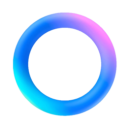

# Chatbot Matrix

The almighty chatbot comparison grid.

| Feature | ChatGPT <a href="https://chatgpt.com"><picture><source media="(prefers-color-scheme: dark)" srcset="img/icon_chatgpt_light.png"><source media="(prefers-color-scheme: light)" srcset="img/icon_chatgpt.png"></picture></a> | Claude  | Gemini  | Mistral  | Copilot  | Meta AI  | Grok <a href="https://grok.com"><picture><source media="(prefers-color-scheme: dark)" srcset="img/icon_grok_light.png"><source media="(prefers-color-scheme: light)" srcset="img/icon_grok.png"></picture></a> | Perplexity <a href="https://www.perplexity.ai"><picture><source media="(prefers-color-scheme: dark)" srcset="img/icon_perplexity_light.png"><source media="(prefers-color-scheme: light)" srcset="img/icon_perplexity.png"></picture></a> | DeepSeek  | Qwen  |
|:-|:-|:-|:-|:-|:-|:-|:-|:-|:-|:-|
| Company | OpenAI | Anthropic | Google | Mistral | Microsoft | Meta | X | Perplexity | DeepSeek | Alibaba |
| Most recent models | GPT-5 / GPT-5 mini | Claude 4.1 Opus / Sonnet 4.5 | Gemini 2.5 Pro / Flash | Mistral Ultra / Large | GPT-5 / GPT-4 | Llama 4 Behemoth / Scout | Grok 4 / Grok 4 Fast | Sonar Pro / Sonar | V3.1 Think / Chat | 2.5 Max |
| Access to latest models | Paid 💰 | Paid 💰 | Paid 💰 | Paid 💰 / Free ✅ | Free ✅ | Free ✅ | Paid 💰 | Paid 💰 | Free ✅ | Free ✅ |
| Context window (tokens) 📏 | 400 K | 1 M | 1 M (Advanced) | 32 K / 128 K | 400 K | 10 M (Scout) | ? | 200 K (Pro) | 128 K | 32 K / 128 K |
| Reasoning 🧠 | Yes ✅ | Yes ✅ | Yes ✅ | Yes ✅ | Yes ✅ | Yes ✅ | Yes ✅ | Yes ✅ | Yes ✅ | Yes ✅ |
| Web search with source citation 🔍 | Yes ✅ | Yes ✅ | Yes ✅ | Yes ✅ | Yes ✅ | Yes ✅ | Yes ✅ | Yes ✅ | Yes ✅ | Yes ✅ |
| Image generation 🎨 | Yes ✅ | No ❌ | Yes ✅ | Yes ✅ | Yes ✅ | Yes ✅ | Yes ✅ | No ❌ | No ❌ | Yes ✅ |
| Analysis of images / documents 🖼️ | Yes ✅ | Yes ✅ | Yes ✅ | Yes ✅ | Yes ✅ | Yes ✅ | Yes ✅ | Paid 💰 | No/ Yes ✅ | Yes ✅ |
| Live mode 🎤 | Multimodal ✅ | Multimodal ✅ | Voice only ✅ | No ❌ | Voice only ✅ | Yes ✅ | Yes ✅ | No ❌ | No ❌ | No ❌ |
| Online "canvas" edition 🖊️ | Paid ✅ | Paid ✅ | No ❌ | Yes ✅ | No ❌ | No ❌ | No ❌ | No ❌ | No ❌ | No ❌ |
| Personalized assistants 📠 | Paid 💰 | Paid 💰 | Paid 💰 | Yes ✅ | No ❌ | Yes ✅ | Paid 💰 | No ❌ | No ❌ | No ❌ |
| Agents with actions 🤖 | "Task Operator" ✅ | "Computer use" ✅ | "Gemini Live" ✅ | Yes ✅ | No ❌ | Yes ✅ | Yes ✅ | "Assistant" ✅ (on mobile app 📱) | Yes ✅ | No ❌ |
| Code interpreter 💻 | Yes ✅ | Yes ✅ | Yes ✅ | Yes ✅ | Yes ✅ | Yes ✅ | Yes ✅ | No ❌ | Yes ✅ | Yes ✅ |
| Personalization, memory 🧠 | Yes ✅ | Yes ✅ | Yes ✅ | Yes ✅ | No ❌ | Yes ✅ | Yes ✅ | Yes ✅ | No ❌ | No ❌ |
| Protection, data storage and use complying with GDPR 🔒 | ⭐⭐/5 Full GDPR compliance is an ongoing process | ⭐⭐⭐/5 Greater privacy in the enterprise version | ⭐⭐/5 Greater privacy in the enterprise version | ⭐⭐⭐⭐/5 GDPR compliant even in free version | ⭐⭐⭐/5 Greater privacy in the enterprise version | | | ⭐⭐/5 Greater privacy in the enterprise version | ⭐/5 No privacy unless using local version | ⭐/5 No privacy unless using local version |
| Mobile app | Yes ✅ | Yes ✅ | Yes ✅ | Yes ✅ | Yes ✅ | Yes ✅ | Yes ✅ | Yes ✅ | Yes ✅ | No ❌ |

Links: [chatgpt.com](https://chatgpt.com/) / [claude.ai](https://claude.ai/) / [gemini.google.com](https://gemini.google.com/) / [chat.mistral.ai](https://chat.mistral.ai/) / [copilot.microsoft.com](https://copilot.microsoft.com/) / [meta.ai](https://www.meta.ai) / [grok.com](https://grok.com) / [perplexity.ai](https://www.perplexity.ai/) / [deepseek.com](https://www.deepseek.com/) / [chat.qwenlm.ai](https://chat.qwenlm.ai/)

Initial sources: [AppyLearny](https://www.appylearny.fr/), [One Useful Thing](https://www.oneusefulthing.org/)

License: CC0 1.0 Universal (CC0 1.0) Public Domain Dedication.

To the extent possible under law, [Steven Van Vaerenbergh](https://github.com/steven2358) has waived all copyright and related or neighboring rights to this work.
