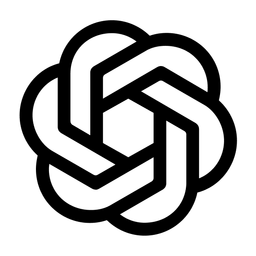
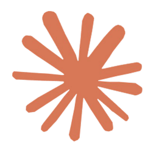
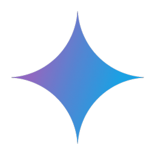
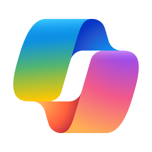
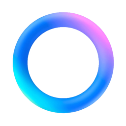

# Chatbot Matrix

Chatbot comparison grid.

| Feature | ChatGPT <a href="https://chatgpt.com"><picture><source media="(prefers-color-scheme: dark)" srcset="img/icon_chatgpt_light.png"><source media="(prefers-color-scheme: light)" srcset="img/icon_chatgpt.png"></picture></a> | Claude  | Gemini  | Mistral  | Copilot  | Meta AI  | Grok <a href="https://grok.com"><picture><source media="(prefers-color-scheme: dark)" srcset="img/icon_grok_light.png"><source media="(prefers-color-scheme: light)" srcset="img/icon_grok.png"></picture></a> | Perplexity <a href="https://www.perplexity.ai"><picture><source media="(prefers-color-scheme: dark)" srcset="img/icon_perplexity_light.png"><source media="(prefers-color-scheme: light)" srcset="img/icon_perplexity.png"></picture></a> | DeepSeek  | Qwen  |
|:-|:-|:-|:-|:-|:-|:-|:-|:-|:-|:-|
| Company | OpenAI | Anthropic | Google | Mistral | Microsoft | Meta | X | Perplexity | DeepSeek | Alibaba |
| Most recent models | GPT-5.4 / GPT-5.3 | Claude Opus 4.6 / Sonnet 4.6 | Gemini 3.1 Pro / Flash | Mistral Large 3 / Mistral 3 | GPT-5.2 | Llama 4 Maverick / Scout | Grok 4.20 / Grok 4 Fast | Sonar Deep Research / Sonar Pro | V3.2 Think / Chat | Qwen 3.5 / Qwen 3.5 Plus |
| Access to latest models | Paid 💰 | Paid 💰 | Paid 💰 | Free ✅ | Free ✅ | Free ✅ | Paid 💰 | Paid 💰 | Free ✅ | Free ✅ |
| Context window (tokens) 📏 | 400 K | 1 M | 1 M (Advanced) | 256 K | 400 K | 10 M (Scout) | 2 M | 200 K (Pro) | 1 M | 1 M |
| Reasoning 🧠 | Yes ✅ | Yes ✅ | Yes ✅ | Yes ✅ | Yes ✅ | Yes ✅ | Yes ✅ | Yes ✅ | Yes ✅ | Yes ✅ |
| Web search with source citation 🔍 | Yes ✅ | Yes ✅ | Yes ✅ | Yes ✅ | Yes ✅ | Yes ✅ | Yes ✅ | Yes ✅ | Yes ✅ | Yes ✅ |
| Image generation 🎨 | Yes ✅ | No ❌ | Yes ✅ | Yes ✅ | Yes ✅ | Yes ✅ | Yes ✅ | Yes ✅ | No ❌ | Yes ✅ |
| Analysis of images / documents 🖼️ | Yes ✅ | Yes ✅ | Yes ✅ | Yes ✅ | Yes ✅ | Yes ✅ | Yes ✅ | Yes ✅ | Yes ✅ | Yes ✅ |
| Live mode 🎤 | Multimodal ✅ | Multimodal ✅ | Voice only ✅ | No ❌ | Voice only ✅ | Yes ✅ | Yes ✅ | No ❌ | No ❌ | No ❌ |
| Online "canvas" edition 🖊️ | Paid ✅ | Paid ✅ | No ❌ | Yes ✅ | No ❌ | No ❌ | No ❌ | No ❌ | No ❌ | No ❌ |
| Personalized assistants 📠 | GPTs 💰 | Paid 💰 | Gems ✅ | Agents ✅ | Agents 💰 | AI Studio ✅ | No ❌ | Spaces 💰 | No ❌ | No ❌ |
| Agents with actions 🤖 | "Task Operator" ✅ | "Computer use" ✅ | "Gemini Live" ✅ | Yes ✅ | No ❌ | Yes ✅ | Yes ✅ | "Assistant" (on mobile app) ✅ | Yes ✅ | No ❌ |
| Code interpreter 💻 | Yes ✅ | Yes ✅ | Yes ✅ | Yes ✅ | Yes ✅ | Yes ✅ | Yes ✅ | No ❌ | Yes ✅ | Yes ✅ |
| Personalization, memory 🧠 | Yes ✅ | Yes ✅ | Yes ✅ | Yes ✅ | No ❌ | Yes ✅ | Yes ✅ | Yes ✅ | No ❌ | No ❌ |
| Data governance and regulatory compliance 🔒 | ⭐⭐⭐/5 | ⭐⭐⭐⭐/5 | ⭐⭐⭐⭐/5 | ⭐⭐⭐⭐/5 | ⭐⭐⭐/5 | ⭐⭐/5 | ⭐⭐⭐/5 | ⭐⭐⭐/5 | ⭐/5 | ⭐/5 |
| Mobile app | Yes ✅ | Yes ✅ | Yes ✅ | Yes ✅ | Yes ✅ | Yes ✅ | Yes ✅ | Yes ✅ | Yes ✅ | Yes ✅ |

Links: [chatgpt.com](https://chatgpt.com/) / [claude.ai](https://claude.ai/) / [gemini.google.com](https://gemini.google.com/) / [chat.mistral.ai](https://chat.mistral.ai/) / [copilot.microsoft.com](https://copilot.microsoft.com/) / [meta.ai](https://www.meta.ai) / [grok.com](https://grok.com) / [perplexity.ai](https://www.perplexity.ai/) / [deepseek.com](https://www.deepseek.com/) / [chat.qwen.ai](https://chat.qwen.ai/)

Initial sources: [AppyLearny](https://www.appylearny.fr/), [One Useful Thing](https://www.oneusefulthing.org/).

License: CC0 1.0 Universal (CC0 1.0) Public Domain Dedication.

To the extent possible under law, [Steven Van Vaerenbergh](https://github.com/steven2358) has waived all copyright and related or neighboring rights to this work.
